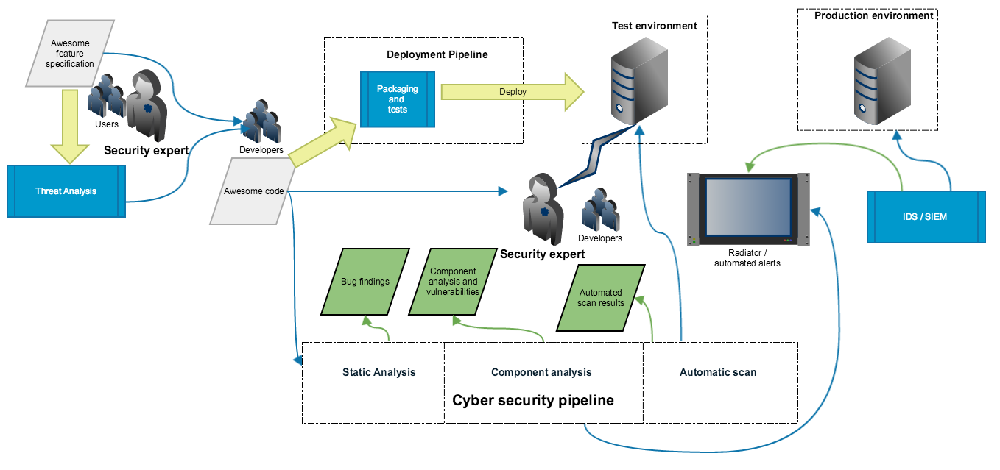

# Kybertyökalut verkkosovelluksen testaamiseen

HUOM: Muista että tietomurron yrittäminenkin on rangaistava teko! Älä tee luvatonta tietoturvatestausta muiden järjestelmille. Tässä mainittujen työkalujen avulla on helppo aiheuttaa vahingossa ongelmia muille tai itselleen.


# Työkalut

## Selaimen developer tools

Hyvin paljon voi tehdä selaimen kehitystyökaluilla. Selaimesta riippuen ominaisuudet ja toiminnon aktivointi ovat erilaisia, mutta tässä on käytetty esimerkkinä Chromea.

Valikosta voidaan avata developer tools näkyviin


Tools tarjoaa näkymiä verkkoliikenteeseen, lähdekoodiin ja muihin asioihin eri välilehdillä.


Javascript-konsolissa voi ajaa Javascript-komentoja ja se on hyödyllinen kun tutkii sovelluksen käyttöliittymän koodin toimintaa. Erityisen hyödyllinen ominaisuus ovat myös breakpointit Javascriptin analysoinnissa.


Lisätietoja ja virallinen dokumentaatio Chromen kehitystyökaluista: [Chrome developer tools](https://developers.google.com/web/tools/chrome-devtools/)


# Proxy

HTTP-proxy, esim. [OWASPZ ZAP](https://www.owasp.org/index.php/OWASP_Zed_Attack_Proxy_Project) tai [Burp](https://portswigger.net/burp) tarjoaa monipuolisen työkalupakin manuaaliseen testaukseen. Passiivisten havaintojen ja manuaalisen testauksen lisäksi nämä työkalut sisältävät erilaisia mahdollisuuksia tehdä automatisoituja testejä ja hyökkäyksiä.

# curl

[curl](https://curl.haxx.se/) on komentorivityökalu, jonka avulla on helppo tehdä HTTP-pyyntöjä ja se täydentää selaimen ja proxyn käyttöä verkkosovelluksen testaamisessa. curl on hyödyllinen bugien raportoinnissa, koska sen avulla raportin vastaanottajan on helppo todentaa havainnon oikeellisuus.

Tässä on esimerkkejä referenssiksi yleisimpien tapauten osalta.

### Peruskutsu, HTTP GET
```
curl http://kohde.fi:8080/status/1
```

### Cookien asettaminen
```
curl --cookie "USER_TOKEN=HAXXOR" http://kohde.fi:8080/status/1
```

### HTTP Basic Auth
```
curl -u username:password http://kohde.fi:8080/status/1
```

### HTTP POST, Form-lomakkeen lähettäminen
```
curl -d "nimi=Teppo&palkka=20000" http://kohde.fi:8080/status/1
```

### HTTP Headerin asettaminen manuaalisesti
```
curl -H 'Content-Type: application/json' http://kohde.fi:8080/status/1


### Muita hyödyllisiä optioita
* ```-v``` - verbose, näyttää yksityiskohtaisia tietoja verkkoliikenteestä kutsun yhteydessä.
* ```@``` avulla voidaan lukea pyyntöä varten data tiedostosta.
* ```curl http://api.fi/fo/[1-14]``` - tehdään pyynnöt 1..14 kerralla
* ```curl http://api.fi/fo/{1, 5, 14}``` - tehdään pyynnöt 1,5,14
* ```-s``` -silent, skriptauksessa hyödyllinen tapa estää ylimääräiset tulostukset
* ```-k``` -insecure, älä välitä SSL-sertifikaatin oikeellisuudesta. Testauksessa usein tarpeellista.

# Kali Linux

[Kali Linux](https://www.kali.org/) on Linux-jakelu, joka sisältää yli sata yleisesti käytettyä tietoturvatestauksen työkalua valmiiksi asennettuna. Kali on yleiskäyttöinen työkalupakki, ei niinkään kohdennettu verkkosovellusten testaamiseen, mutta suosittelemme tutustumaan siihen.

Kali Linuxista on tarjolla valmis virtuaalikone-image, jonka avulla sitä on helppo ajaa omassa koneessa eristettynä normaalista käytöstä. 

Erityisesti hyödyllisiä perustyökaluja Kalin mukana ovat [nmap](https://nmap.org/), [netcat](http://netcat.sourceforge.net/) ja [sqlmap](http://sqlmap.org/).

*Huomioi että Kali Linux voi itsessään olla tietoturvariski omalla työasemallesi jos et tiedä mitä olet tekemässä!*

# Staattisen koodianalyysin työkalut

Jos lähdekoodi on käytettävissä sitä kannattaa käyttää apuna havaintojen tekemisessä. Ohjelmointikielestä riippuen hyödylliseksi todettuja työkaluja ovat ainakin seuraavat:

* [FindBugs](http://findbugs.sourceforge.net/). Lisää myös [FindSecBugs plugin](https://github.com/find-sec-bugs/).
* [SonarQube](https://www.sonarqube.org/)
* [Coverity](http://www.coverity.com/)

Näiden työkalujen havaintoraportit pitää käydä manuaalisesti läpi, koska ne voivat sisältää vääriä positiivisia. 

# Riippuvuusanalyysi

Moderni ohjelmisto sisältää useita riippuvuuksina mukaan tuotuja kolmannen osapuolen komponentteja, jotka voivat sisältää haavoittuvuuksia. Näiden tarkastamiseen on olemassa useita työkaluja, joista olemme havainneet toimiviksi seuraavat:

* [OWASP Dependency Check](https://www.owasp.org/index.php/OWASP_Dependency_Check)
* [retire.js](https://retirejs.github.io/retire.js/)
* [VersionEye](https://www.versioneye.com/)

# Työkalujen integrointi CI/CD-putkeen

Analyysityökalujen ajaminen voidaan automatisoida, joten suosittelemme soveltamaan tämän tyyppistä *Cyber Security Pipeline* ajattelua ohjelmistokehityksessä.




